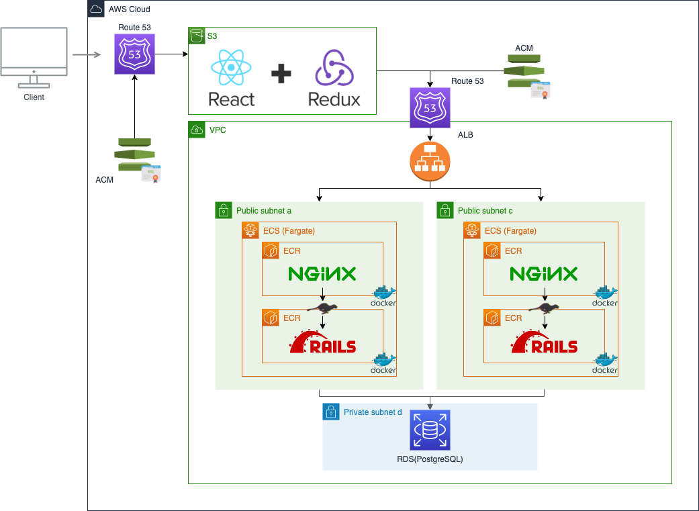
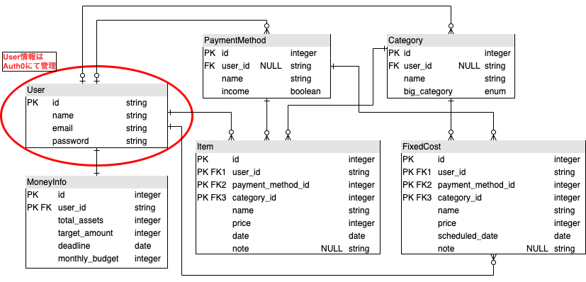

# KakeiboApp_v2_frontについて
このソースコードは家計簿アプリ「SUM APP」のバックエンド部分になります。
 
また「SUM APP」は貯金目標の達成を補助してくれる家計簿アプリです。アプリケーションのURL、アプリケーション概要につきましては以下をご参照ください。

- [アプリケーションURL](https://www.kakeibo-app.com/)
- [アプリケーション概要](https://www.kakeibo-app.com/tech_info)

## インフラ構成について
インフラ構成につきましては、以下の図の通りAWSを中心に構築しています。
 
本ソースコードは以下の図のREACT + REDUX部分になります。

## 実装機能について
実装されている機能に関しては以下のようになっています。
- ユーザーの作成及びログイン機能
- 収支情報を登録、編集、削除する機能
- ユーザーごとにカテゴリ、支払情報等を追加する機能
- 合計保有資産、貯金目標、貯金達成目標日、月予算を登録して月々の残り予算、必要月貯金額等を算出する機能
- 日別収支情報、カテゴリ別収支内訳等の分析をする機能

## データベース設計について
データベースの設計に関しては以下のER図の通りとなります。

## 使用している主なgemについて
- Rspec：　Railsの代表的なテストツールの一つ。単体テスト、統合テストを実行するために使用しました。
- Factory Bot：　テストのサンプルデータを簡単に作成することができるgem。